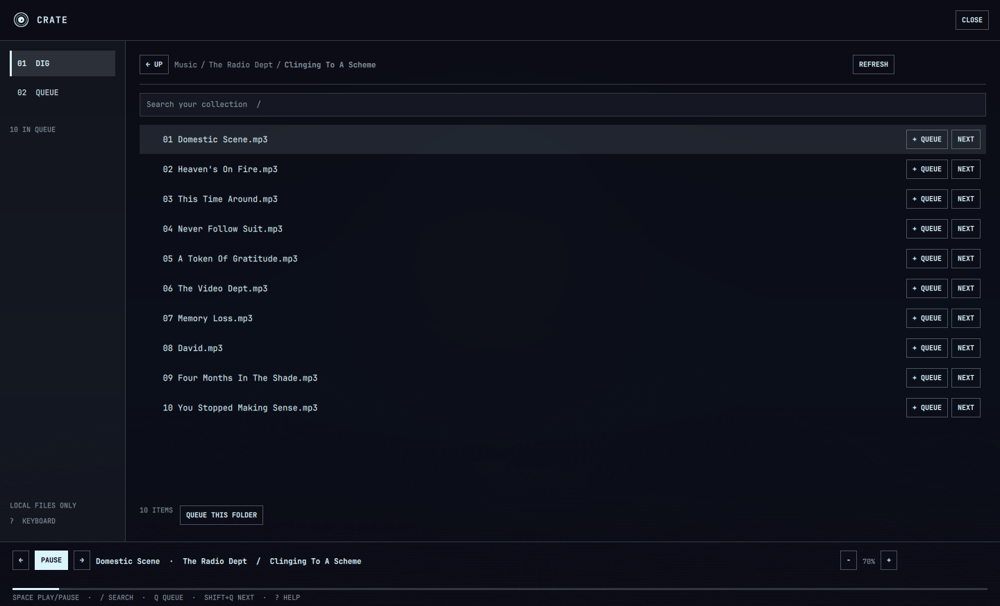

<p align="center">
  
</p>

<h1 align="center">Crate</h1>

<p align="center"><strong>Dig → Queue → Play</strong></p>

A fast, minimal local music player for Omarchy. Your filesystem is your music
library: open Crate, dig through your folders, build a queue, and get back to
work. No import or account is needed.



## Dig → Queue → Play

- **Dig:** Browse `~/Music` by folder or press `/` to search names and paths
  across your collection. Search matches tracks and folders, including artist
  and album names when they appear in the path. Fuzzy matches help with partial
  names. Search for an artist such as Radiohead, then click the folder result
  or choose **Open folder** from its **⋯** menu to see the albums. Choose the root from Crate's **Settings → Music folder**. This saved choice takes
  precedence over the bar widget's default **Music folder** setting.
- **Queue:** Add a track or a whole folder (including its subfolders), play it
  next, reorder or remove items, clear the queue, or shuffle what comes next.
- **Play:** Use previous, play/pause, next, seek, system output volume.
  Crate shows track title, artist, and album when mpv provides that metadata;
  filenames work when tags are missing.

Click a track or choose **Play now** from its **⋯** menu to play it and continue with the following
tracks in its album folder. The queue labels these automatic entries **ALBUM**.
Tracks added with **+ QUEUE** or **Q** are labeled **QUEUED** and play before
album continuation, in the order you added them. **Play next** in the **⋯** menu or **Shift+Q** inserts
immediately after the current song, ahead of other requests.
Playing another track or folder replaces album continuation and preserves your
explicit requests. Folder **Play now** starts at its first track. Queueing a folder
adds all its tracks as explicit requests. Manually moving album entries gives
the reordered prefix explicit priority; shuffle keeps the two priorities separate.
Finished and skipped tracks are removed, including the final track. The last
100 played/skipped tracks remain in playback history. Previous restarts a song
after three seconds; pressing it again within 1.5 seconds goes back. History
also works after the final song finishes. Queue rows
show title and artist from tags, with an artist-folder fallback when tags are
missing. Mouse and keyboard deletion keep the same scroll position.
On a folder row, click its name to open it and keep digging.
The path above the file list is a set of breadcrumbs: click any folder name
there to jump back to it. Drag the path sideways when it is wider than the
window.

The queue, current track, playback position, and last browsed directory are
saved under `~/.local/state/omarchy/crate/state.json` (or
`$XDG_STATE_HOME/omarchy/crate/state.json`). Press play after restarting the
shell to resume the saved track and position. Closing the browser leaves music
playing.

When NTS Radio starts local playback, Crate pauses and keeps its place. Starting
Crate pauses local NTS playback. NTS casting to another device is unaffected.
Crate works the same when NTS Radio is not installed.

## Requirements and installation

- Omarchy with the Quickshell plugin system
- `mpv` for playback
- Python 3 for folder browsing and search
- `ffprobe` (from FFmpeg) for queued track tags; folder names work without it

With `omarchy-shell` running, install from GitHub:

```bash
omarchy plugin add https://github.com/sjfortin/omarchy-crate.git --enable
omarchy-shell crate open
```

For local development, place this folder at
`~/.config/omarchy/plugins/sjfortin.crate`, then use:

```bash
omarchy plugin validate ~/.config/omarchy/plugins/sjfortin.crate
omarchy plugin enable sjfortin.crate
omarchy-shell crate open
```

Click **CRATE** in the bar to open it; middle-click to play or pause, and scroll
to change volume.

To show Crate in Omarchy's **Apps** menu, run:

```bash
~/.config/omarchy/plugins/sjfortin.crate/desktop/install-app.sh
```

Open Apps with **Super+Alt+Space**, or open the Omarchy menu with **Super+Space**
and choose Apps. **Super+Shift+Space** toggles the top bar in the default
Omarchy bindings. The app entry only opens the enabled plugin; it does not
install a separate player. The launcher icon lives at `assets/crate.svg`; the
same record mark appears in the bar and browser, colored by the active theme.
The installer refuses to replace an existing launcher or icon with different
contents. Removal deletes only files that still match Crate's shipped files;
edited or unrelated files are left in place.
The bar also has previous, play/pause, and next buttons. The bar keeps a fixed **CRATE** label and record mark; the mark dims when
paused or stopped. Track details appear in the hover tooltip. Click the label or mark
to open Crate; middle-click there to play/pause, or scroll to change volume.
The player shows elapsed time and total track length beneath the seek bar.

## Keyboard

| Key | Action |
| --- | --- |
| `1` / `2` / `3` | Dig / Queue / Mixtapes |
| `↑` / `↓` or `j` / `k` | Move selection |
| `Shift+j` / `Shift+k` in Dig | Jump to the next letter / start of this or the previous letter group |
| `←` / `h` | Parent folder |
| `→` / `l` | Open selected folder |
| `Enter` | Open folder or play the selected track |
| `Backspace` / `Esc` | Parent folder / clear search / close |
| `/` | Search the collection |
| `q` / `Shift+q` | Queue selection / play it next |
| `Space` | Play or pause |
| `Shift+j` / `Shift+k` or `Ctrl+↓` / `Ctrl+↑` in Queue | Move selected queue item down / up |
| `Delete` / `Backspace` | Remove selected queue item |
| `Ctrl+Z` | Undo a queue edit |
| `Ctrl+A` in Dig | Select all visible entries |
| `Ctrl+click` / `Shift+click` | Toggle selection / select a range |
| `Tab` / `Shift+Tab` | Focus controls |
| Arrow keys on the seek slider | Seek |
| `?` | Shortcut help |

**CLEAR OTHERS** removes every queued track except the current one, which keeps playing.

While typing a search, press `↓` or `Tab` to move focus to the results. Digits and punctuation remain ordinary search text. Returning to Dig keeps
the search results visible with focus on keyboard navigation.

Use **QUEUE FOLDER** to add the current folder and its subfolders. Search
runs only when requested and cancels obsolete scans; Crate does not build a separate music database.
Search currently uses filenames and folder paths, so metadata that appears
only inside file tags is not indexed. Large collections may take longer on the
first search. Accent-insensitive matching supports searches such as `bjork`
for `Björk`. Results show a title and a separate folder path; queue actions
show a brief confirmation, and empty searches explain how to try again.

Crate volume controls the default system output, follows global volume and
mute changes, and updates when the output device changes. mpv stays at 100%
so there is no second hidden gain setting. These controls affect other apps
using that output too.

Crate reads local music and makes no network requests. It plays MP3, FLAC,
Ogg, Opus, AAC/M4A, WAV, and other formats supported by mpv. It does not
change your music files.

Crate is intentionally queue first. Accounts, streaming, recommendations,
ratings, and large library-management screens are outside its scope.

## Queue, folders, and mixtapes

- Use row checkboxes, Ctrl+click, or Shift+click to select tracks and folders,
  then **Queue selected** or **Next**. Folder additions are processed in order;
  quick repeated clicks are retained. Collection limits produce visible warnings.
- **Undo** / `Ctrl+Z` reverses up to 20 additions, removals, reorders, shuffles,
  or clears during the session. Restoring a removed current track leaves it
  paused at its saved position. Moving to the next song or starting a new
  album clears the undo history.
- **Queue → Save Mixtape** stores the current queue under a unique name.
  **Mixtapes** can queue or play that saved list; deleting it leaves music files
  untouched. Renaming or moving source files can make saved entries unavailable.
- **Pin** keeps the current folder in **Folders**, alongside the eight most
  recently opened folders. Pins, recent folders, mixtapes, the chosen music root,
  and playback history are saved with the queue.
- Dig and Queue remember their selection and scroll position while the browser
  instance remains loaded. Reopening keeps the search text. Shell restarts
  restore the last folder, but not transient search or selection state.
- Drag or click anywhere in the seek slider's 24-pixel interaction area. Hover
  to see the destination time. System volume includes a mute toggle.
- Playback failures remain visible with Retry/Skip when a current track is
  available. Empty screens offer a way back to browsing or folder selection.

Queue tags stream into the UI one track at a time in small batches, prioritizing
current and visible tracks. Search still reads filenames and paths without a
persistent index. Result limits and incomplete collection scans are reported
separately.

To turn it off, run `omarchy plugin disable sjfortin.crate`. For a Git-installed
plugin, `omarchy plugin remove sjfortin.crate` removes plugin files. Saved queue
data remains in the state directory for you to keep or delete.
The optional Apps entry can be removed with
`~/.config/omarchy/plugins/sjfortin.crate/desktop/install-app.sh --remove`
before removing the plugin.

## Contribute

`Service.qml` owns playback, queue, search, and saved state. `Browser.qml` is
the Dig and Queue window; `BarWidget.qml` provides bar controls.
`scripts/browse.py` reads folders, searches paths, and collects folder tracks
without leaving the configured music root.
`desktop/` contains the optional Apps launcher entry.
Playback disables mpv's reference loading and automatic companion-file loading,
so a playlist disguised as an audio file cannot instruct it to open other files
or URLs. Crate manages its queue itself.

Run these checks after changes:

```bash
omarchy plugin validate ~/.config/omarchy/plugins/sjfortin.crate
python3 -m unittest discover -s tests -v
bash tests/test_ui.sh  # isolated offscreen Quickshell check
```

Please also test playback and navigation in a running Omarchy shell when
changing the QML interface.
